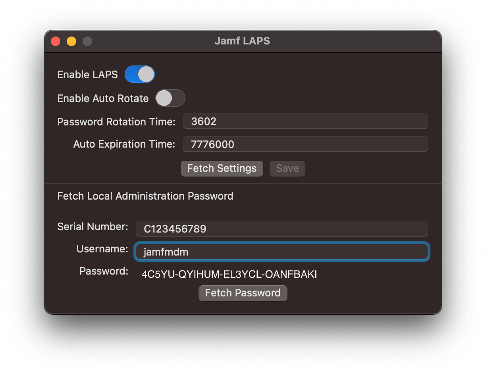

# Jamf-LAPS

Jamf Pro 10.45 introduced a new "Local Administrator Password Solution" (LAPS) API endpoint. LAPS helps admins avoid the practice of creating a single static admin account password on their managed devices. 

This app will allow you to:

- Enable / Disable the service
- Set the number of seconds for the password rotation time
- Set the number of seconds for the password auto expiration time
- Retrieve the password for a given Mac and LAPS username

### Requirements

- A Mac running macOS Ventura (13.0)
- Jamf Pro 10.45 or higher
- Jamf Pro Account that has the following minimum permissions:
  - Send Local Admin Password Command
  - Update Local Admin Password Settings
  - View Local Admin Password
  - View Local Admin Password Audit History
  - Read Computers

### History
- 1.0.1
  - Fixes an issue authenticating against multi-context Jamf Pro environments
- 1.0
  - Moved the Jamf Pro url and authentication details to settings
  - Added support for Jamf Pro API Roles and Clients introduced in Jamf Pro 10.49
- 0.9.1
  - Added logging. Use `sudo log stream --info --predicate 'subsystem=="com.jamf.jamf-laps"'` to view the logs
  - Fixed an issue where the LAPS user name was not being passed correctly.
- 0.9: Initial release

THE SOFTWARE IS PROVIDED "AS-IS," WITHOUT WARRANTY OF ANY KIND, EXPRESS OR IMPLIED, INCLUDING BUT NOT LIMITED TO THE WARRANTIES OF MERCHANTABILITY, FITNESS FOR A PARTICULAR PURPOSE AND NON-INFRINGEMENT. IN NO EVENT SHALL JAMF SOFTWARE, LLC OR ANY OF ITS AFFILIATES BE LIABLE FOR ANY CLAIM, DAMAGES OR OTHER LIABILITY, WHETHER IN CONTRACT, TORT, OR OTHERWISE, ARISING FROM, OUT OF OR IN CONNECTION WITH THE SOFTWARE OR THE USE OF OR OTHER DEALINGS IN THE SOFTWARE, INCLUDING BUT NOT LIMITED TO DIRECT, INDIRECT, INCIDENTAL, SPECIAL, CONSEQUENTIAL OR PUNITIVE DAMAGES AND OTHER DAMAGES SUCH AS LOSS OF USE, PROFITS, SAVINGS, TIME OR DATA, BUSINESS INTERRUPTION, OR PROCUREMENT OF SUBSTITUTE GOODS OR SERVICES.

Copyright 2023, Jamf
